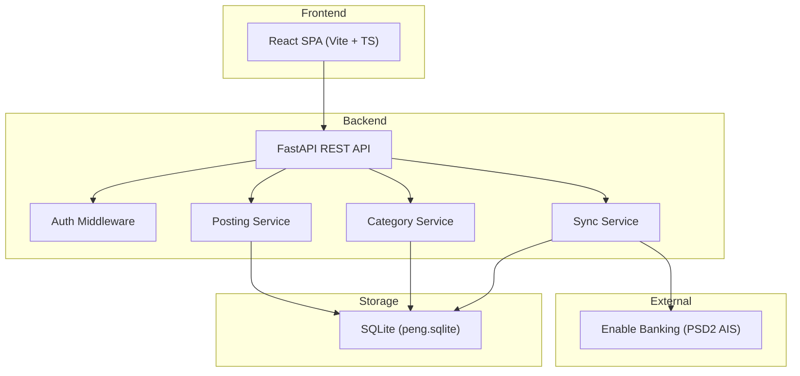
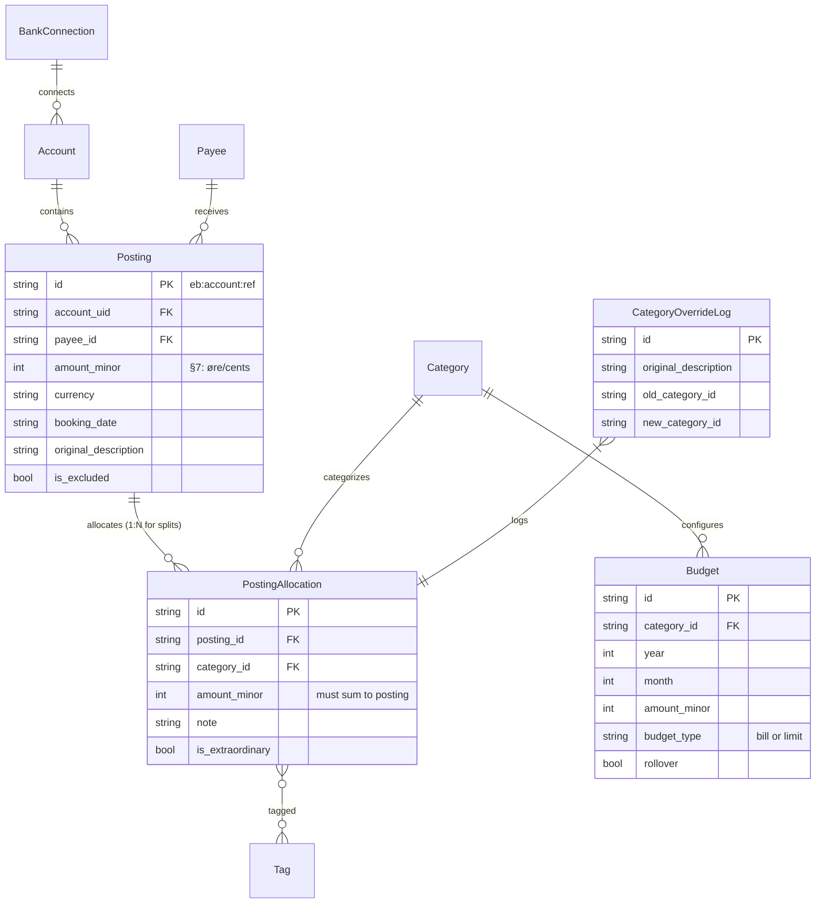

# Architecture Overview

Peng consists of a decoupled frontend and backend, with a SQLite database for persistence.

## System Components

## Data Model (V3)

The normalized V3 data model separates immutable bank data (Posting) from mutable user data (PostingAllocation).

## Key Design Decisions

| Decision | Rationale |
|----------|-----------|
| `amount_minor: int` | Eliminates floating-point errors ([ADR-0001](decisions/0001-integer-money-storage.md)) |
| Posting vs PostingAllocation | Separates immutable bank data from mutable user categorization ([ADR-0004](decisions/0004-split-transactions-and-allocations.md)) |
| Dual-Database Architecture | Isolates core ledger from heavy receipt/Storebox ingestion payloads ([ADR-0005](decisions/0005-dual-database-kvitteringer-storage.md)) |
| Inbound Email & Storebox | Automates digital receipt ingestion and autolinking ([ADR-0003](decisions/0003-storebox-inbound-email-forwarding.md)) |
| Household Management | Multi-tenant economics and email member invitations ([ADR-0002](decisions/0002-household-management-and-invitations.md)) |
| CategoryOverrideLog | Enables offline ML training for auto-categorization |
| Pluggable auth | `AUTH_PROVIDER=none\|basic\|oidc` supports single-user and multi-user deployments |

## Data Flow

1. User initiates sync via frontend → `POST /api/sync/start`
2. Backend connects to Enable Banking PSD2 API
3. Raw transactions normalized → `Posting` rows with `amount_minor` (int)
4. Default `PostingAllocation` created for each posting (1:1)
5. User categorizes via frontend → allocation updated, override logged
6. Insights computed from Posting + Allocation data
