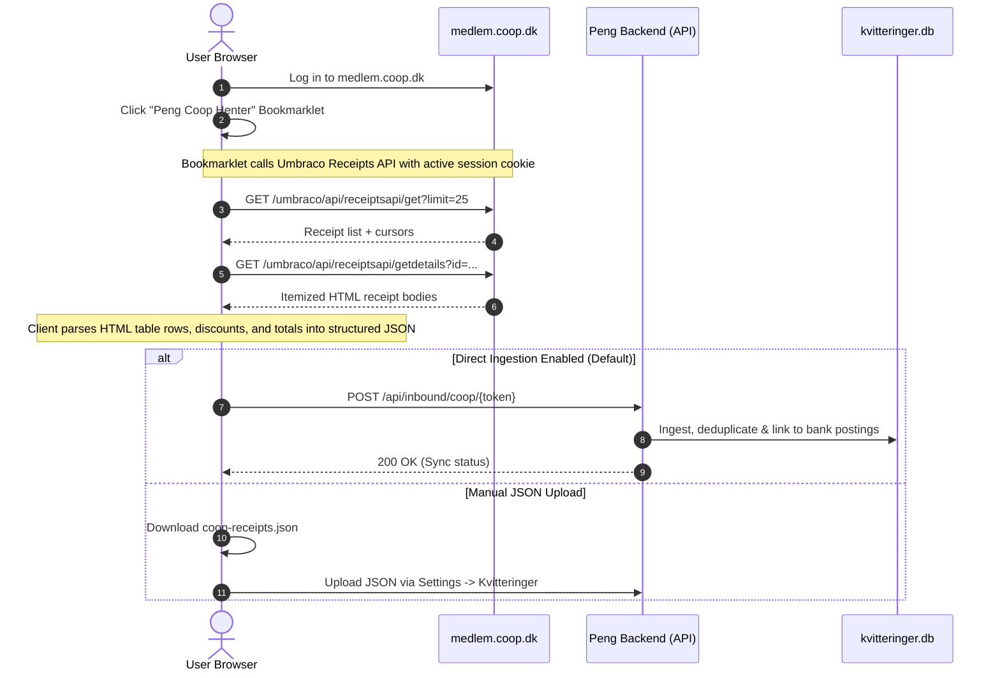

# Coop Receipts Integration Guide

Peng includes a native integration for digital receipts from **Coop Danmark** (covering 365discount, SuperBrugsen, Kvickly, Dagli'Brugsen, and Irma).

This allows you to automatically ingest itemized Coop purchase receipts, item breakdown prices, and discounts, and link them to bank transactions alongside Storebox receipts in Peng's dual-database receipt engine.

---

## 1. How It Works

Coop does not currently offer a public Open Banking API for itemized receipts. To provide a seamless, bank-grade experience without requiring you to store your Coop member credentials on your Peng server, Peng uses a **Client-Side Bookmarklet & Inbound Ingestion API**.

---

## 2. Using the Bookmarklet

### Step 1: Get your Bookmarklet
1. Open Peng and navigate to **Indstillinger (Settings) -> Kvitteringer & Bilag** (or the **Receipts Overview Card**).
2. Locate the **Coop Integration (Beta)** section.
3. Drag the **"Peng Coop Henter"** button to your browser's Bookmarks bar (or click *Kopier bookmarklet-kode* if on mobile or Safari).

### Step 2: Run on Coop Member Portal
1. Navigate to [medlem.coop.dk](https://medlem.coop.dk/) and log in with your Coop credentials / MitID.
2. Click the **"Peng Coop Henter"** bookmark in your browser bookmarks bar.
3. A floating modal appears in the top-right corner.
4. Select the time period:
   - **Alle kvitteringer** (Full history)
   - **Seneste 3 måneder** (90 days)
   - **Seneste 30 dage**
5. Click **Start Hentning & Synk**.
6. The bookmarklet will fetch the receipts in concurrent batches, parse the items, and automatically transmit them securely to your Peng instance using your inbound token.

---

## 3. Manual JSON Upload

If you prefer offline or manual ingestion:
1. In the bookmarklet modal, you can download the generated `coop-receipts.json` file.
2. In Peng under **Indstillinger -> Kvitteringer**, use the **Upload Coop JSON** file picker.
3. Peng will validate the receipt schema, normalize dates and amounts, and store the receipts in `kvitteringer.db`.

---

## 4. Multi-Source Architecture & Matching

- **Coexistence**: Coop receipts coexist side-by-side with Storebox receipts. If a purchase exists in both systems, Peng's deduplication logic prevents duplicate receipt records while ensuring itemized line items are preserved.
- **Transaction Linking**: Peng matches Coop receipts to bank postings based on:
  1. Exact or near timestamp overlap (purchase datetime vs. bank posting date).
  2. Total transaction amount in minor currency units (e.g. øre / DKK cents).
  3. Store chain recognition (e.g., *Coop 365*, *SuperBrugsen*, *Kvickly*, *Coop App*).
- **Split Transactions**: Once matched, Peng allows you to split the bank posting into individual category allocations corresponding to the receipt lines (e.g. Groceries vs. Household Goods vs. Personal Care).

---

## 5. Security & Privacy

- **Zero Credential Sharing**: Your Coop username and password are never stored, transmitted to, or handled by Peng.
- **Inbound Webhook Security**: Direct ingestion uses a secret per-household inbound token (`/api/inbound/coop/{token}`).
- **Self-Hosted**: All parsed line items and store details remain on your self-hosted instance.
